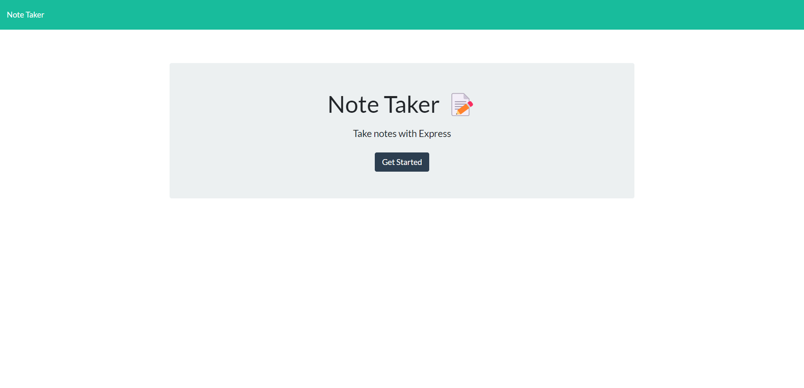
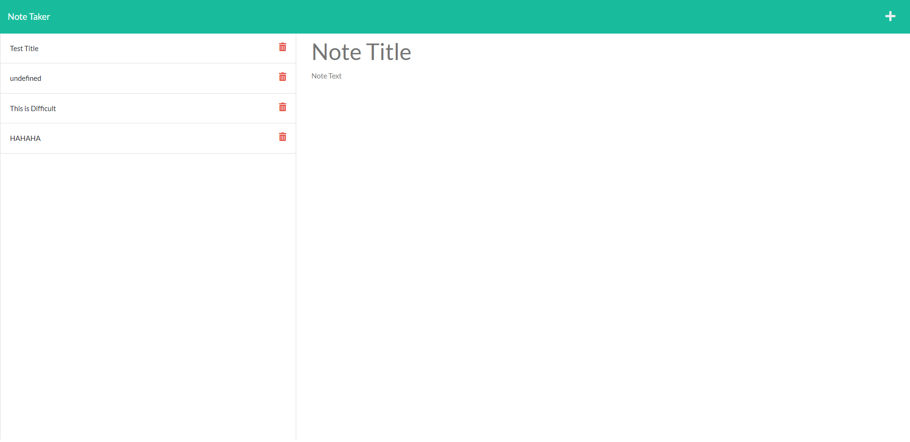

# Note Taker

## Description

In this project I created a note taking application that allows the user to save their notes in the app, and click on them so that they can be read and reviewed in the future.

## Table of Contents
- Installation
- My Work

- Questions

## Installation

To install this project on your local device, you will need to have Node.JS running on your server. 

Once the project is pulled down onto your local device, please open an integrated terminal and run "npm install". That will install Express, Nodemon, and UUID. 

## My Work

Please feel free to view my application here: [https://my-notetaker-app.herokuapp.com/notes](https://my-notetaker-app.herokuapp.com/notes)

## Questions

If you have any questions about my work, please feel free to contect me at alyssarodri.develop@yahoo.com or [visit my Github](https://github.com/AlyssaRodri)